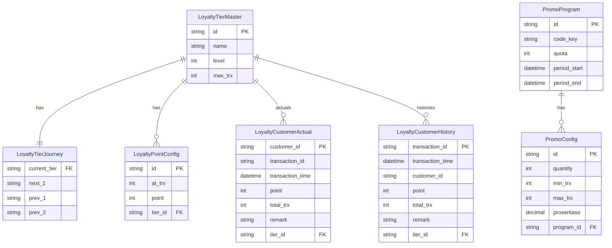
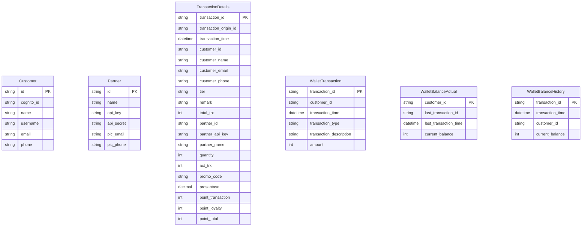

# KezBek Solution
## Deskripsi
KezBek Solution merupakan salah satu start up yang memberikan keuntungan kepada pelanggan berupa uang kembalian _(cashback)_ ketika pelanggan melakukan transaksi di merchant yang terdaftar.

Penentuan besarnya _cashback_ yang akan diterima oleh pelanggan mempertimbangkan 2 faktor, yaitu transaksi dan loyalti. 

Secara sistem, KezBek Solution merupakan keseluruhan sistem yang saling terintegrasi satu sama lain dengan mengimplementasikan arsitektur metarepo microservices.

Setiap services memungkinkan untuk menggunakan tech stack yang berbeda. Seperti Service authenticator menggunakan AWS Cognito, service mailer menggunakan AWS SES, service transaction menggunakan PostgreSQL sementara service customer menggunakan MySQL.

Meskipun tech stack yang digunakan berbeda, namun secara keseluruhan service services ini dapat saling berkomunikasi satu dengan lainnya menggunakan tranport RabbitMQ sehingga dapat menjawab kebutuhan KezBek Solution.

Berikut adalah rancangan DB yang ada di KezBek Solution.

## Running di local
- Karena menggunakan metarepo, lakukan `git clone` pada metareponya kezbek-solution.
- Gunakan `git submodule update --init --recursive` untuk update/fetch submodules.
- Lakukan `npm install` di setiap submodule yang ada atau jika menggunakan linux/macos, dapat langsung running file `setup.sh` yang sudah disiapkan.
- Pada docker compose, environment variable menggunakan file `compose.env` yang sudah disiapkan atau dapat diatur sendiri sesuai kebutuhan di local.
- Jalankan perintah `docker-compose up -d --build`
- Setelah semua service up, dapat langsung dicoba, tentu dengan melakukan loading data terlebih dahulu dengan perintah berikut di folder `sql`

`docker exec -i mysql mysql -uroot -pS3cret db_customer < customer.sql`

`docker exec -i mysql mysql -uroot -pS3cret db_partner < partner.sql`

`docker exec -i mysql mysql -uroot -pS3cret db_promo < promo.sql`

`docker exec -i postgresql psql -U postgres db_loyalty < loyalty.sql`

- Untuk setiap service terdapat documentasi menggunakan swagger, contoh service authenticator: http://localhost:8000/authenticator/apidoc. Untuk detail port yang digunakan adalah sebagai berikut:
1. [Service Authenticator](http://localhost:8000/authenticator/apidoc)
2. [Service Customer](http://localhost:8000/customer/apidoc)
3. [Service Loyalty](http://localhost:8000/loyalty/apidoc)
4. [Service Mailer](http://localhost:8000/mailer/apidoc)
5. [Service Partner](http://localhost:8000/partner/apidoc)
6. [Service Promo](http://localhost:8000/promo/apidoc)
7. [Service Transaction](http://localhost:8000/transaction/apidoc)
8. [Service Wallet](http://localhost:8000/wallet/apidoc)

Contoh container yang sedang running

## Asumsi
1. Proses transaksi dilakukan di partner
2. Data yang dikirim ke KezBek Solution adalah data transaksi yang sudah complete dari partner. KezBek Solutin menghandle proses perhitungan cashback, transfer balance wallet dan send email notifikasi.

## Referensi

[Creating separate monorepo CI/CD pipelines with GitHub Actions](https://blog.logrocket.com/creating-separate-monorepo-ci-cd-pipelines-github-actions/)

[Monorepo, Manyrepo, Metarepo](https://notes.burke.libbey.me/metarepo/)

